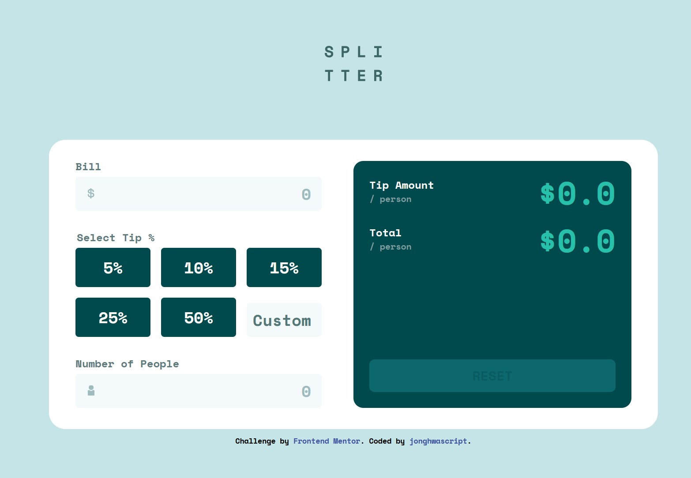

# Frontend Mentor - Tip calculator app solution

This is my solution to the [Tip calculator app challenge on Frontend Mentor](https://www.frontendmentor.io/challenges/tip-calculator-app-ugJNGbJUX). The app calculates the tip and total amount per person using a bill amount, a preset or custom tip percentage, and the number of people.

## Table of contents

- [Overview](#overview)
  - [The challenge](#the-challenge)
  - [Design reference](#design-reference)
  - [Links](#links)
- [My process](#my-process)
  - [Built with](#built-with)
  - [Running locally](#running-locally)
  - [What I learned](#what-i-learned)
  - [Continued development](#continued-development)
  - [AI collaboration](#ai-collaboration)
- [Author](#author)
- [Acknowledgments](#acknowledgments)

## Overview

### The challenge

The challenge is to build a responsive tip calculator with interactive input controls and accurate amounts per person.

The current implementation supports:

- Mobile, tablet, and desktop layouts using Flexbox and CSS Grid.
- Preset tip percentages of 5%, 10%, 15%, 25%, and 50%, plus a custom percentage.
- Recalculation when the bill, number of people, or tip selection changes.
- Validation for empty or non-positive bill amounts, non-positive or fractional numbers of people, and negative tip percentages.
- A Reset action that clears tip selections and error messages, sets the bill and people fields to zero, and resets the results.

### Design reference



This is the supplied challenge preview, not a screenshot of the implementation.

### Links

- Solution URL: [Repository](https://github.com/jonghwascript/tip-calculator-app.git)

- Live Site URL: [Live site](https://jonghwascript.github.io/tip-calculator-app)

## My process

### Built with

- Semantic HTML, including `fieldset`, `legend`, and `output`.
- SCSS variables, partials, mixins, and nested selectors.
- Flexbox, CSS Grid, logical properties, and `rem` units.
- A mobile-first layout with tablet and desktop breakpoints.
- JavaScript and a locally bundled jQuery 4.0.0 file.
- Gulp and Dart Sass for SCSS compilation and CSS source maps.
- Prettier for formatting checks.

### Running locally

Install the dependencies and compile the styles:

```sh
npm ci
npm run build
```

Open `index.html` in a browser. To compile SCSS automatically when it changes, run:

```sh
npm run dev
```

The development task watches SCSS files; it does not start a web server or reload the browser automatically.

Available checks:

```sh
npm run check
node --check js/main.js
```

`npm run check` checks the formatting of HTML, SCSS, the Gulp configuration, and `package.json`. The Node command checks JavaScript syntax. Neither command verifies calculator behavior or accessibility in a browser.

### What I learned

The following lessons summarize what I learned while building and debugging this project.

#### Semantic form structure

`fieldset` groups related controls, and `legend` describes that group. I used them for tip selection. The `output` element represents the calculated result.

```html
<fieldset>
  <legend>Select Tip %</legend>
  <!-- Tip controls -->
</fieldset>

<output class="tip">$0.00</output>
```

#### Responsive sizes and layout

I practiced converting pixel values to `rem` by dividing by the baseline font size of 16. This allows the logo, spacing, and text to share a consistent scale.

```scss
.title img {
  width: 5.4375rem; // 87px at a 16px root font size
  max-width: 100%;
  height: auto;
}
```

I also learned that `width: 100%` refers to the containing block, while `max-width` only sets an upper limit. A desktop breakpoint does not guarantee a fixed element width.

For a Reset button at the bottom of a result panel, a column flex layout and `margin-block-start: auto` use the available space without a hardcoded vertical offset.

#### Selectors must match the HTML structure

A sibling selector such as `~` cannot select an input's parent label. With a nested radio input, `:has()` lets the label respond to the checked state:

```scss
label:has(input[name='tip']:checked) {
  background-color: v.$green-400;
  color: v.$green-900;
}
```

The same idea works for choosing the correct icon on an input wrapper. The pseudo-element belongs to `.input-group`, so the selector must target that wrapper:

```scss
.input-group:has(input[name='people'])::after {
  background-image: url('../images/icon-person.svg');
}
```

SCSS nesting also affects selector specificity. I learned to check the compiled selector when a utility class did not override a component's background color.

#### Input values and number conversion

For these input fields, jQuery's `.val()` returns a string, even when the input uses `type="number"`.

| Input state | Value from `.val()` | Numeric conversion |
| --- | --- | --- |
| Empty | `""` | `0` |
| Zero | `"0"` | `0` |
| One hundred | `"100"` | `100` |

A placeholder is not an actual input value. Also, `"0"` is truthy, so checking `!bill.val()` alone does not reject zero. I use numeric comparisons and `Number.isInteger()` for the number of people.

#### Events and custom tip selection

The `input` event responds to edits such as typing, pasting, and deleting. The `change` event handles committed changes. jQuery's `.add()` combines controls into one collection for event registration.

In a regular event callback, `this` identifies the control handling the event. Its value is not always the tip percentage: it could be the bill or the number of people.

I update the tip selection before validating the other inputs:

```js
if ($(this).is(custom)) {
  tipRadio.prop('checked', false);
} else if ($(this).is(tipRadio)) {
  custom.val('');
}

const selectedTip = tipRadio.filter(':checked');
const tipPercent = selectedTip.length
  ? Number(selectedTip.val())
  : Number(custom.val());
```

This keeps preset and custom tips mutually exclusive, even when the bill or number of people is still incomplete. In the current implementation, no selected preset and an empty Custom field result in a zero-percent tip.

#### Calculating and displaying results

Both displayed amounts are per person:

```js
const tipAmount = (billAmount * (tipPercent / 100)) / peopleCount;
const total = billAmount / peopleCount + tipAmount;
```

For a bill of 100, a 15% tip, and two people, the tip is `$7.50` per person and the total is `$57.50` per person.

I extracted repeated display updates into one function:

```js
function renderResult(tipAmount = 0, total = 0) {
  $('.output-tip .tip').text(`$${tipAmount.toFixed(2)}`);
  $('.output-result .result').text(`$${total.toFixed(2)}`);
}
```

`renderResult()` resets the displayed amounts, while `renderResult(tipAmount, total)` displays a calculation. Formatting happens after the calculation because `.toFixed(2)` returns a string.

#### Validation and Reset have different responsibilities

Calling the full Reset function during validation erased the bill while the number of people was still empty. Validation should preserve what the user typed, show errors, and return a boolean. Invalid input resets only the displayed results; the Reset button clears the full form state.

A `return` inside `isValid()` exits only that function. The event handler must check its result explicitly:

```js
if (!isValid()) {
  renderResult();
  return;
}
```

#### Hiding number input arrows

I learned how to hide the number input's spinner controls while retaining its numeric input behavior:

```scss
input[type='number'] {
  -moz-appearance: textfield;
  appearance: textfield;

  &::-webkit-inner-spin-button,
  &::-webkit-outer-spin-button {
    -webkit-appearance: none;
    margin: 0;
  }
}
```

This changes the appearance of the controls; it does not disable keyboard arrow-key adjustments.

### Continued development

- Add an explicit label for the Custom field and a visible keyboard focus state for tip options.
- Improve validation messages so they explain negative amounts, fractional people, and invalid custom tips accurately.
- Update both field error states on each validation pass instead of returning after the first invalid field.
- Check keyboard navigation, browser zoom, small-screen readability, and large result values in the browser.
- Reduce deeply nested SCSS selectors and add behavior tests for tip switching, validation, and Reset.

### AI collaboration

I used Codex to discuss selectors, input events, validation, SCSS, and code review, and to help organize the documentation. I applied the JavaScript changes manually and asked for follow-up reviews.

Small, disconnected replacement snippets were difficult to follow and sometimes left old conditions in place. Instructions that identified the exact block to replace, explained the execution order, and focused on one change at a time were more useful. This helped me distinguish input validation, result rendering, and full form reset.

## Author

- Frontend Mentor — [@jonghwascript](https://www.frontendmentor.io/profile/jonghwascript)
- GitHub — [@jonghwascript](https://github.com/jonghwascript)

## Acknowledgments

Thanks to Frontend Mentor for the challenge design and assets.
